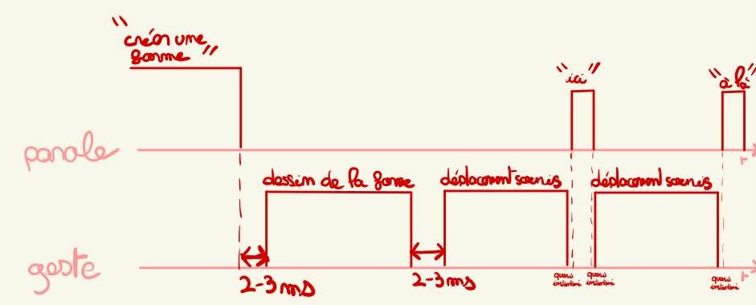
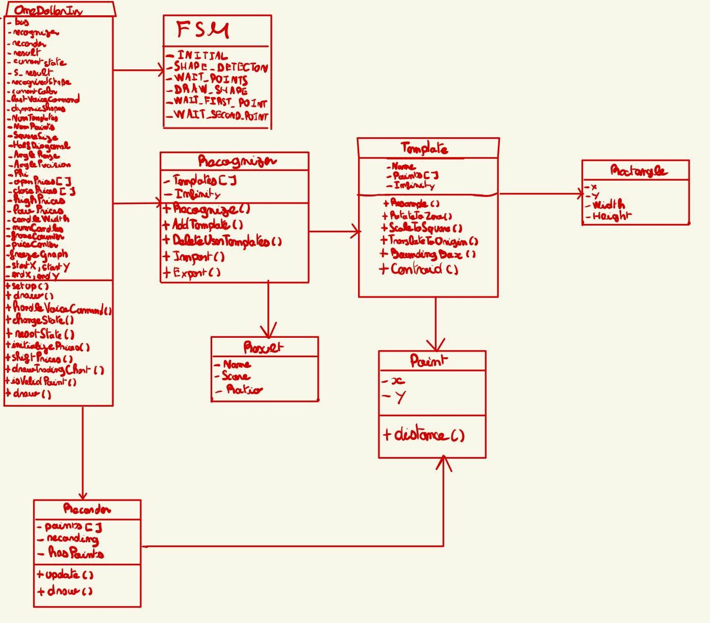
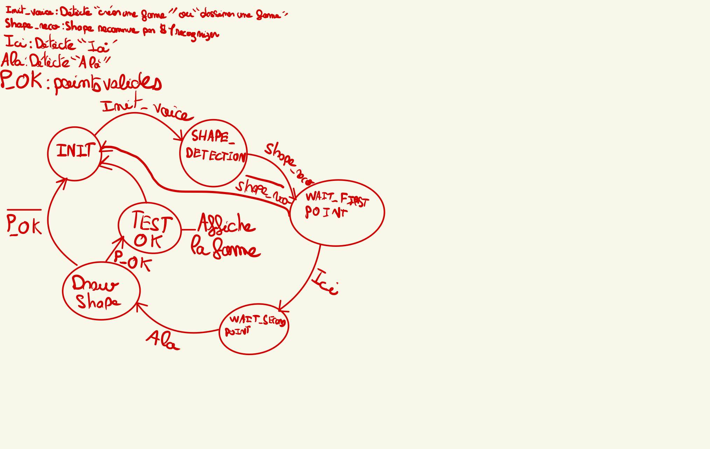

# ** Rapport de TP : IHM Multimodale **
Réalisé par Pierre DAUDIN | Antoine CLEMENT MALICK | Valentin POQUE

## Introduction  
Dans le cadre de ce TP sur les interfaces homme-machine (IHM) multimodales, notre objectif était de concevoir une application intégrant et combinant différents modes d’interaction, tels que la parole et le dessin, en complément des actions classiques de la souris et du clavier. Pour y parvenir, nous avons utilisé des outils dédiés, notamment SRA5 pour la reconnaissance vocale et OneDollarIvy pour la reconnaissance de formes.

Nous avons ainsi choisi de développer une interface de trading interactive qui invite l’utilisateur à interagir par la voix, le dessin, et des actions spécifiques pour réaliser différentes opérations.

## Choix opérés
Nous avons essayé tout au long de ce projet de placé l’utilisateur au cœur du projet. Pour ce faire, tous nos choix et toutes nos réflexions étaient orientés confort utilisateur.
Le principal enjeu de notre projet côté utilisateur était d'appréhender le moment où il allait dessiner la forme qu’il souhaite. Étant donné que la courbe est dynamique et évolue au cours du temps il est compliqué de dessiner dessus, c’est pourquoi nous avons fait le choix de figer la courbe durant le laps de temps où l’utilisateur dessine.
Nous avons également crée un exécutable pour lancer le projet.

## Schémas
### Chronogrammes

### Diagramme de classe

## Machine à état
